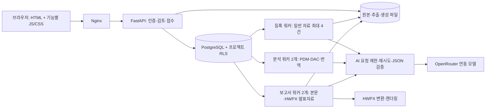

# 서비스 구조 리팩토링 — 2026-09-25

## 설계 범위

기존 URL·화면 구성·계정·파일·원문 검증 규칙을 유지하면서 책임과 실행 경계를 분리했다.
API 응답과 긴 AI 작업이 같은 프로세스 수명에 종속되는 문제를 줄이는 것이 핵심이다.
Redis를 추가하지 않고 기존 PostgreSQL을 작업 큐로 사용한다.

## 코드 경계

| 경계 | 파일 |
| --- | --- |
| 화면 구조·정적 UI·데이터 연결 | `frontend/index.html`, `assets/app-styles.css`, `app-shell.js`, `app-controller.js` |
| API 조립 | `api/application.py` |
| 업무별 라우트 | `auth_routes`, `project_routes`, `intake_routes`, `evaluation_routes`, `report_routes` |
| 요청 모델·인증·시작/종료 | `api/schemas.py`, `dependencies.py`, `middleware.py`, `lifecycle.py` |
| 관리자 큐 상태·프롬프트 지문 | `api/operations_routes.py` |
| 주 JSON 요청 경로 | `ai_gateway.py`; 이전 `openrouter.py` import 호환 |
| 핵심 프롬프트 | `ai/prompts/document_intake.md`, `foundation_pdm.md`, `performance_measurements.md` |
| 보고서 분량 정책 | `report_content_policy.py` |
| 계획서 필드별 사실·위치 | `foundation_facts.py`, `source_locations.py` |
| 무검출 재검토·DAC 범위 확대 | `measurement_recheck.py`, `dac_scope_policy.py` |
| 사람 검토·불변 평가 승인 | `report_review_policy.py`, `evaluation_versions.py`, `assets/service-review.js` |
| 기준 문서 변경 영향·지표 정체성 | `foundation.py`, `indicator_identity.py` |
| 전역 AI 예산·작업 예산 | `ai/global_budget.py`, `ai/job_budget.py` |
| 격리 파싱·영속 번역 | `parse_sandbox.py`, `translation_jobs.py` |
| 체크섬 기반 DB 변경 이력 | `migration_history.py`, `migrations/001_*.sql` ~ `005_*.sql` |

기존 업로드·분석 검토·트레이·인증·관리자 UI 모듈을 유지한다. 전문 보고서의 `prompts/Section*.py`와
리스크 정책 `performance_risk_policy.md`도 유지한다. 프레임워크 교체를 위한 전면 재작성은 하지 않았다.
PDM은 항목 수에 따라 짧을 수 있어 1,500자 강제 규칙을 제거했다. 원문 수치·구조 검증은 유지한다.
일반 섹션의 목표 최소 분량은 품질 점수·경고로 평가하고 생성 실패 원인으로 사용하지 않는다.
빈 본문·누락 구조·원문 및 수치 불일치·국문 요약 형식 등은 계속 검사한다.
평가등급표는 기존 2쪽 배치가 인쇄 영역에 들어갈 때 유지하고, 넘으면 평가기준 묶음을 보존하면서 페이지를 재배치한다.

## 접수와 실행

PDM, DAC, 개별/전체 보고서, 이어서 생성, HWPX, 발표자료의 접수 레코드와 `workflow_tasks`를 같은 트랜잭션에 저장한다.
접수 성공 뒤 API가 종료되어도 큐 항목이 남는다. 실패 시 접수·큐 모두 롤백한다.
긴 작업은 API의 `BackgroundTasks`에서 실행하지 않는다.

워커는 `analysis`와 `reports` 큐로 나눈다. 각 큐의 2개 슬롯마다 PostgreSQL advisory lock으로 활성 리더 한 개를 두고
`FOR UPDATE SKIP LOCKED`로 작업을 가져온다. 짧은 claim 잠금으로 프로젝트별 공정 배정과 같은 프로젝트의 workflow 중복 실행 방지를 묶는다.
프로젝트·계정·모델 문맥을 복원한다.
핸들러가 예외 없이 반환해도 업무 결과가 실패/부분 성공이면 큐도 동일하게 기록한다.
이미 취소되거나 삭제된 작업은 실행하지 않는다.

워커 재시작 시 이전 실행 작업을 중단 상태로 표시하고 저장된 본문·근거 캐시를 보존한다.
외부 요청은 이미 과금됐을 수 있으므로 사용자가 재실행/이어쓰기를 요청하게 한다.
리더 DB 연결 상실을 감지하면 프로세스를 종료한다. 이는 단일 호스트 운영 보호이며 분산 exactly-once 보장은 아니다.

일반 업로드는 기존 단계별 큐를 사용하고 실행 시점의 최신 연동 모델을 읽는다.
명시적 PDM/DAC/보고서 작업은 검토·실행 시 선택한 모델을 작업에 고정한다.

## AI 호출과 추적

주 JSON 호출과 멀티모달 경로에 동시 요청 제한을 적용한다. `AI_MAX_IN_FLIGHT=4`는 프로세스당 상한이고,
`AI_GLOBAL_IN_FLIGHT=4`는 같은 DB/API 키를 사용하는 프로세스 전체의 공유 상한이다. 요청·토큰·비용과 작업 시간/시도 예산도 DB에 예약한다.
입력 제한·민감 문자열 제거·응답 스키마·유한 재시도·취소 확인을 유지한다.
발표자료·시각화의 별도 멀티모달 전송 형식에도 같은 요청 슬롯 제한을 적용한다.

등록 분석과 보고서 생성 메타데이터에 프롬프트 파일 SHA-256을 기록한다.
큐에는 접수 시점과 워커 실행 시점의 지문을 각각 저장한다.
지문에는 템플릿과 동적 프롬프트 조립 코드·정책 모듈을 포함한다. 승인 시 입력·매핑·모델·정책·평가·본문·검토자를 불변 버전으로 묶는다.
공급자의 모델 내부 버전까지 재현하는 완전한 실험 추적 시스템은 아니다.

새 HTTP 로그는 `X-Request-ID`, 경로 템플릿, 상태, 처리 시간만 기록한다.
쿠키·쿼리 문자열·원문을 포함하지 않는다. 기존 분석 로그 전체의 개인정보 마스킹은 별도 감사 대상이다.

## DB와 시작 순서

일회성 `kodame-migrate`가 스키마 advisory lock 아래 체크섬을 확인하고 번호별 마이그레이션·큐 스키마·RLS를 적용한다.
성공해야 API를 열고, API 건강 확인 뒤 워커·웹을 시작한다. 일반 재시작에서 DDL을 반복하지 않는다.
DB 이름·기존 볼륨·프로젝트 ID는 유지한다. 관리자 비밀은 migrator만 사용하고 앱 계정 비밀번호를 분리한다.

현재는 단일 호스트·DB이며 분석/보고서는 각각 최대 2개 프로젝트 작업을 처리한다. 일반 등록은 최대 4개 문서다.
오프호스트 백업은 사용자 요청으로 제외했다. 로컬 암호화 백업·격리 복원은 검증했으나 호스트 장애를 견디는 HA 구성은 아니다.
완료 기준별 검증과 잔여 위험은 `improvements-20260925.md`에 기록한다.
